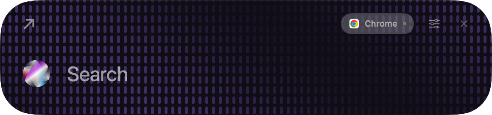
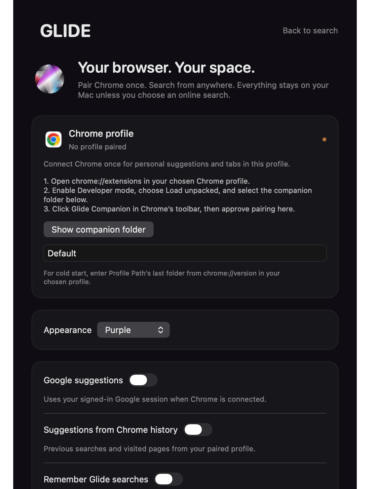

# Glide

A native macOS search launcher. Press **Shift + Space**, type a search or URL, and open a new tab in the Chrome profile you paired. Glide reuses an existing normal window in that profile.

Built with SwiftUI, AppKit and Core Animation. Purple, blue, black, graphite, midnight and rose appearances are available in Settings. Suggestions stay hidden until you type. The rounded panel expands downward while keeping its header stable; Enter reveals Chrome through a frosted boundary transition. Reduce Motion is respected.



## Privacy first

Glide has **no account, backend, analytics, telemetry or developer data collection**. Pairing uses a random identifier stored locally in your Chrome profile, not your email address. Cookies stay in Chrome.

Google suggestions, Chrome-history suggestions, saved Glide searches and launch-at-login are **off on a fresh installation**. You can enable each separately. When you explicitly open a search, the query goes to Google in Chrome; opening a website contacts that website. Enabling Google suggestions also sends what you type to Google using your existing Chrome session. See [Privacy](docs/PRIVACY.md) for exact data flows.

## Install and connect

Requires macOS 14 or newer, Google Chrome, and Apple Command Line Tools. The build targets the architecture of your Mac (Apple silicon or Intel). This is a source release: it is locally ad-hoc signed, not notarized or distributed through the Mac App Store.

1. Install the developer tools with `xcode-select --install` if needed.
2. Clone this repository and build:

   ```sh
   git clone https://github.com/himanshuchawla0807-gif/glide.git
   cd glide
   zsh build.sh
   ```

3. Copy `dist/Glide.app` to `/Applications/Glide.app` and launch it. The first launch opens the connection screen. Keep this installed copy in place: Chrome's native host registration points to it.
4. Open **the Chrome profile you want Glide to use**. Visit `chrome://extensions`, enable **Developer mode**, and choose **Load unpacked**.
5. Select `/Applications/Glide.app/Contents/Resources/Glide Companion`. Glide's connection screen has a **Show companion folder** button.
6. Click the Chrome Extensions button, then **Glide Companion**. Return to Glide and choose **Approve this Chrome profile**. Approve only after clicking the companion in the profile you intend to pair. The connection screen should show a connected indicator.
7. In that same Chrome profile, visit `chrome://version`. Find **Profile Path** and copy its final folder name, such as `Default` or `Profile 2`, into Glide's **Chrome profile directory** field. This enables the correct profile to start when Chrome is quit; it is not a full filesystem path.
8. Choose **Back to search**. Press **Shift + Space** to open or dismiss the launcher.



You do not need Full Disk Access or Accessibility permission to use the global Carbon shortcut. If the shortcut is occupied by another app, Glide reports that and remains available from the menu bar.

## Use

- **Return:** open the selected result.
- **Up / Down:** select a result.
- **Tab:** complete a result into the input.
- **Escape:** dismiss.
- **Command + comma:** open Settings.

A URL opens directly; other text becomes a Google search. Only HTTP and HTTPS destinations are accepted. Incognito windows are excluded. A new normal window is created only when the paired profile has none.

Settings controls appearance, optional suggestions and history, profile pairing and launch-at-login. Disconnect before switching profiles, then repeat the pairing step. Keep the companion enabled; Glide will not silently send a query to an unpaired profile.

## Development

```sh
zsh build.sh
zsh test.sh
```

The build uses the Apple toolchain and has no downloaded Swift dependencies. The companion has no runtime npm dependencies. Tests require Node.js in addition to Swift. CI builds on macOS and checks query handling, native transport and mocked Chrome routing. [Architecture](docs/ARCHITECTURE.md), [Setup and troubleshooting](docs/SETUP.md), and [Contributing](CONTRIBUTING.md) describe the implementation and limits.

This public edition uses original native visual artwork. Personal reference films, copied component sources, account details and browser data are not included.

MIT licensed. See [LICENSE](LICENSE).
