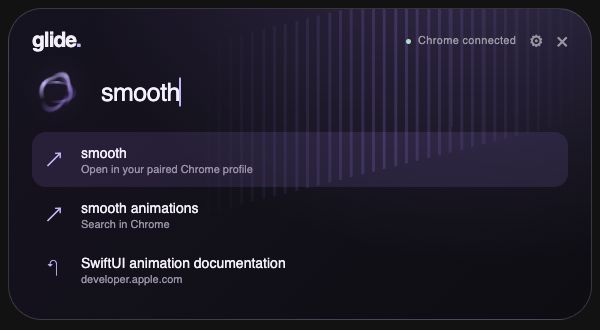

# Glide for Windows

Press **Shift + Space**, type a search or URL, and open a tab in your paired Chrome profile. Suggestions appear only while typing. The purple panel keeps its header anchored as results unfold. Enter fades and blurs the launcher. Choose Purple, Blue, Black, Graphite, Midnight or Rose in Settings. Reduced motion is respected through WebView2's media query.

This edition uses a **Rust / Tauri 2 backend** and a small HTML/CSS/JavaScript interface rendered by Microsoft Edge WebView2. It runs no web server and installs no separate browser. Chrome remains your search browser. The Mac edition uses SwiftUI and AppKit.



*Interface preview rendered on Mac; Windows uses Segoe UI and WebView2.*

## Requirements

Windows 10 or 11 **x64**, Google Chrome, and the [Microsoft Edge WebView2 Runtime](https://developer.microsoft.com/en-us/microsoft-edge/webview2/). This is a preview: builds and core tests run on Windows CI, but interactive visual quality and Windows/Chrome combinations need user testing. It is unsigned; Windows may show a publisher warning. The transition affects Glide's surface; it does not blur Chrome's page or the Windows desktop.

## Install and connect

1. Download **Glide-Windows.zip** from the Windows release and extract it.
2. Open Terminal in that folder and run:
   ```powershell
   powershell -NoProfile -ExecutionPolicy Bypass -File .\install.ps1
   ```
   This policy applies to this script process only. The installer copies the complete package to `%LOCALAPPDATA%\Programs\Glide`, creates a Start Menu shortcut and launches Glide. No administrator rights needed. You can also copy the complete folder there yourself and run `Glide.exe`.
3. In **your chosen Chrome profile**, open `chrome://extensions`, enable Developer mode, and choose **Load unpacked**. Use **Show companion** in Glide to locate `%LOCALAPPDATA%\Programs\Glide\Companion`.
4. Click **Glide Companion** in Chrome's Extensions menu, then **Approve profile** in Glide. Approve only the profile whose companion you just clicked.
5. Visit `chrome://version` in that profile. Find the final folder name under **Profile Path**, such as `Default` or `Profile 2`, and enter it in Settings. This lets Glide launch that profile when Chrome is closed. Do not use the full path.
6. Choose **Back to search**. Press Shift + Space whenever you want to search.

Glide lives in the notification area. Its tray menu has Search, Settings and Quit. This preview does not configure launch at login: use the Start Menu shortcut after rebooting. If Shift + Space is occupied by another app, an error appears and the tray menu remains available.

## Use

Enter opens the selected result; Up/Down changes selection; Tab completes it. Escape dismisses. Ctrl + comma opens Settings. Suggestions are optional and off initially. Disconnect before pairing another profile.

The companion creates a tab in a normal window of the paired profile and brings it forward. It creates a new normal window only when that profile has none. Incognito is excluded. Glide does not intentionally route searches to unpaired profiles. If the profile folder is incorrect, fix it and open the intended profile manually.

## Privacy

No Glide account, backend, analytics or developer collection. No cookies are read. Preferences and pairing stay in this Windows user account. The companion exchanges bounded JSON frames with a local native helper over an authenticated named pipe, without a localhost TCP port. The random profile identifier stays in Chrome's local extension storage. Settings and the session token live in `%LOCALAPPDATA%\Glide` with inherited Windows user permissions. Other processes running as the same user are within the local trust boundary.

Submitting searches sends them to Google through Chrome. Enabling Google suggestions sends typed text to Google. Chrome history suggestions stay on the machine. Glide saves no query history in this edition. Native host registration is per user under `HKCU\Software\Google\Chrome\NativeMessagingHosts\com.himanshu.glide`.

## Build

Install stable [Rust](https://rustup.rs/), Visual Studio Build Tools with **Desktop development with C++**, and WebView2. Clone the repository, then:

```powershell
cd windows
cargo test --locked -p glide-core
# Optional interface tests (requires Node.js 22+): npm ci; npm test
.\build.ps1
```

The package is `windows/dist/Glide-Windows.zip`. Both executables must remain together. Chrome launches `glide-native-host.exe`; Glide handles the UI and shortcut. Sources: `core/` for queries/framing, `src-tauri/` for the application/helper, `ui/` for the interface, and the shared `Companion/` in the repository root.

## Troubleshooting and uninstall

If pairing stalls, leave Glide running, disable/re-enable the companion and click it again. Enterprise policy may block unpacked extensions or native messaging. Install WebView2 if missing. Moving only Glide.exe breaks its helper path; reinstall the complete package.

Quit from the tray before upgrading or removing. Run `uninstall.ps1` to remove the application, Start Menu shortcut and native host registration. Remove the companion in Chrome. Preferences are retained: delete `%LOCALAPPDATA%\Glide` separately to reset them.

MIT licensed. Report bugs with Windows version and reproduction steps, without private queries, browser data or session.json.
